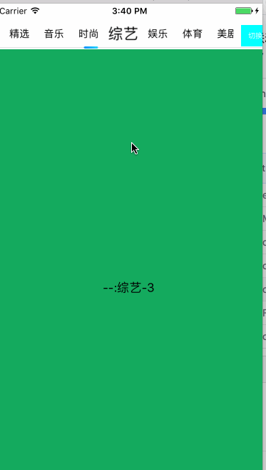
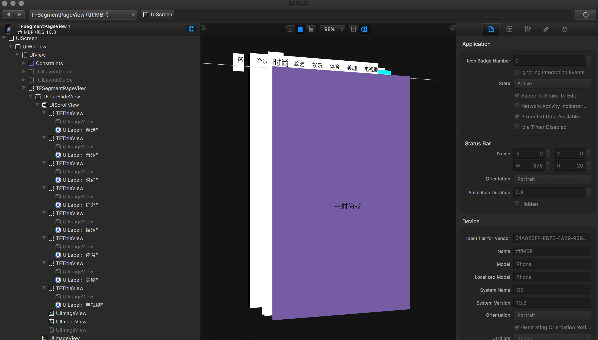

# TFSegmentPageView

---
网易新闻, 腾讯视频, 头条 等首页的滑块视图联动的效果OC版的简单方便的集成, 滑块

基于UIColelctionView实现的，高性能的横滑控件。可以很方便的对条目进行排序重置等。

## Requirements

iOS 7.0+

## Installation

. 直接将下载文件的TFSegmentPageView文件夹下的文件拖进您的项目中然后`#import "TFSegmentPageView.h"`就可以使用了

## 日志
. Update 2017/06/03 增加截图，完善工程